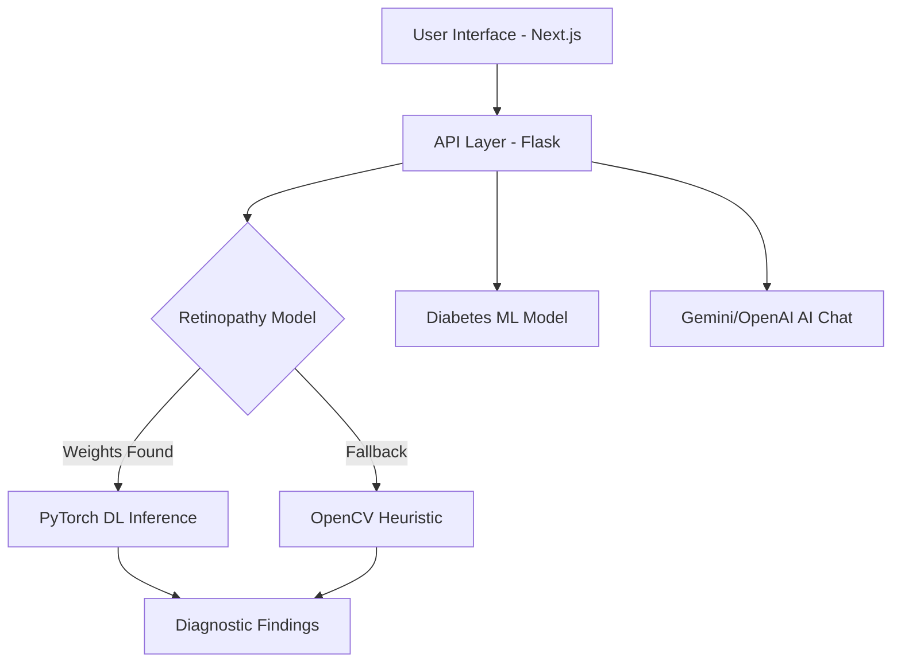

# 👁️ Retinopathy & Diabetes Detection Suite

[](https://github.com/Shavitjnr/Retinopathy-Detection-System)
[](https://github.com/Shavitjnr/Retinopathy-Detection-System)
[](https://github.com/Shavitjnr/Retinopathy-Detection-System)

A high-fidelity diagnostic system that combines **Deep Residual Learning** and **Computer Vision** to detect Diabetic Retinopathy and predict diabetes risk. This suite features a modern glassmorphism dashboard and an AI-powered medical assistant.

---

## 🚀 Key Features

### 🔬 Retinopathy AI Scanner

- **Dual-Inference Engine**: Intelligent switching between **Deep Learning (ResNet18)** and high-accuracy **Computer Vision heuristics**.
- **Clinical Integration**: Trained on the clinical **APTOS 2019 dataset** (3,662+ retinal scans).
- **Interactive Overlays**: Neon-cyan vascular segmentation and real-time lesion annotation (Hemorrhages, Exudates).
- **WHO Grading**: Automated grading into 5 stages of Diabetic Retinopathy.

### 🩸 Diabetes Risk Predictor

- **Feature-Based Analysis**: Predicts risk based on glucose levels, BP, insulin, and BMI.
- **Instant Result**: Real-time confidence scores and diagnostic verdicts.

### 🤖 Dr. Retina AI

- **Smart Assistant**: Integrated chatbot powered by **Gemini Pro** / **OpenAI**.
- **Clinical Context**: Context-aware medical guidance for patients and clinicians.

---

## 🛠️ Tech Stack

- **Frontend**: Next.js 15, React 19, Tailwind CSS, Lucide Icons, Shadcn UI.
- **Backend**: Flask (Python 3.14+).
- **Deep Learning**: PyTorch, Torchvision (ResNet18).
- **Computer Vision**: OpenCV, NumPy.

---

## 📦 Installation & Setup

### 1. Project Setup

```bash
git clone https://github.com/Shavitjnr/Retinopathy-Detection-System.git
cd Retinopathy-Detection-System
```

### 2. Backend Installation (Python)

```bash
pip install flask pandas numpy scikit-learn torch torchvision opencv-python pillow flask-cors python-dotenv google-generativeai
python app.py
```

### 3. Frontend Installation (Next.js)

```bash
cd web-app
npm install
npm run dev
```

---

## 📂 System Architecture



---

## 🛡️ Clinical Disclaimer

This application is for **educational and research purposes only**. It is not a substitute for professional medical advice, diagnosis, or treatment. Always seek the advice of a qualified physician with any questions regarding a medical condition.

---

## 📄 License

Distributed under the MIT License. See `LICENSE` for more information.

_Built by Shavitjnr._
